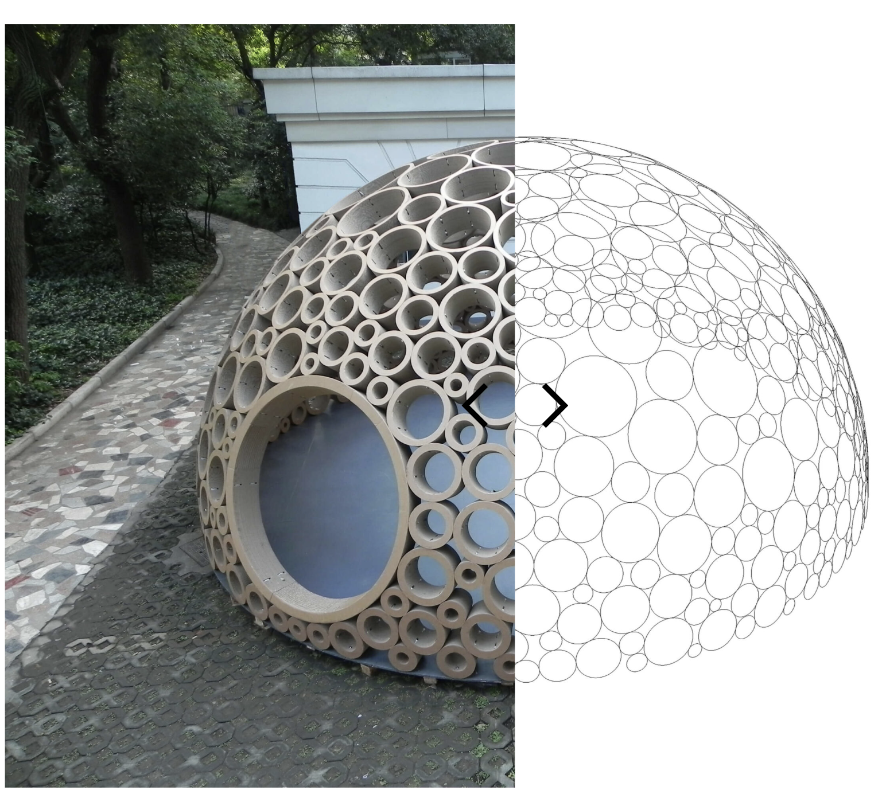
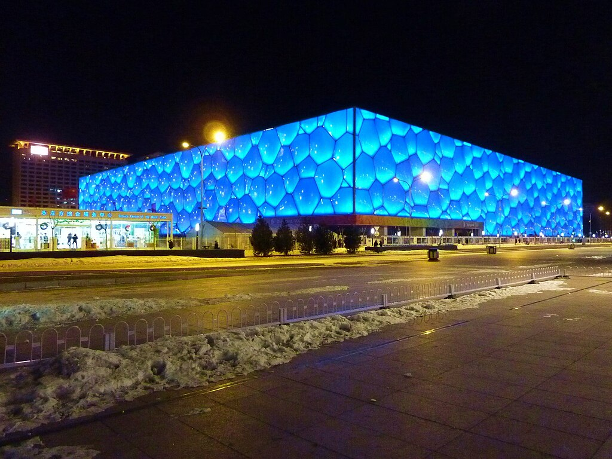
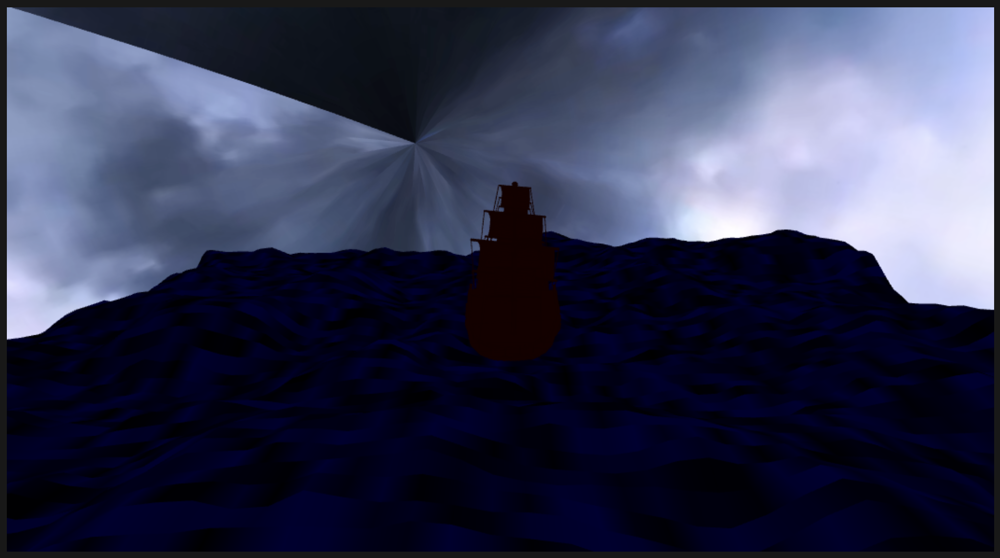

# yzha0190_9103_tut2

## PART1:
The Packed Pavilion, shown at a paper-art exhibition in Shanghai at the close of World Expo 2010, which authors wrote a computer program that allowed the cones to combine with each other through a 3D circle packing process.
The main water sports venues for the 2008 Beijing Olympics, the Water Cube’s shell adopts the Weaire–Phelan foam, yielding irregular polygons (triangles, quadrilaterals, heptagons). 
Building on these precedents, I want to re-express “Wheels of Fortune” in 3D, based on circle packing. Adding shallow 3D forms heightens light–shadow contrast and rhythmic density, improving readability and immersion.

## PART2:
I will try to use the circle packing routine in p5.js, while making circles on the canvas, grow them each frame to fill all scene, and stop growth when an overlap is detected. This yields a non-overlapping, organic layout. I can map to 3D by extruding each circle as a shallow cylinder or ball shape in WEBGL. Radius to height and brightness and a slow rotation reinforce the “wheel” rhythm. Works like Joe DeNavas's ONWARD! and INTERWINED both use 3D Geometries in JavaScript, p5.js.

[Link Text](https://openprocessing.org/sketch/2187000)
[Link Text](https://thecodingtrain.com/challenges/50-animated-circle-packing)
[Link Text](https://thecodingtrain.com/tracks/webgl/webgl/2-3d-geometries)
